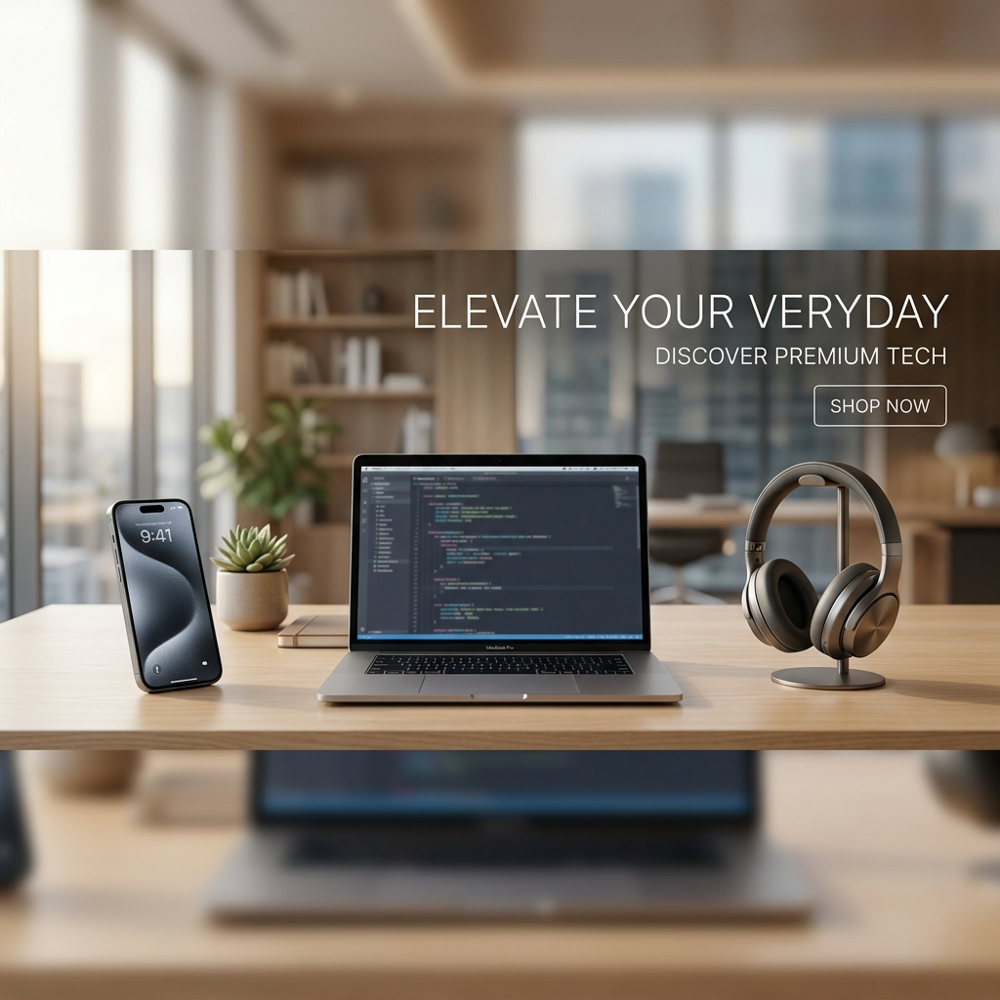
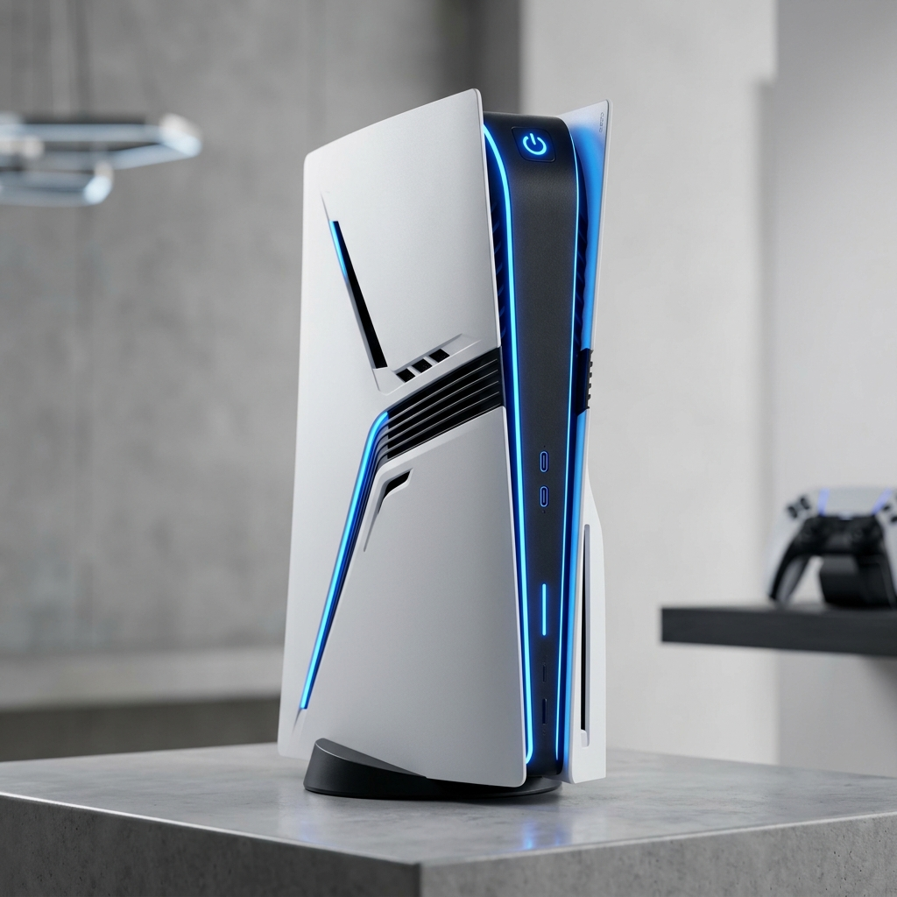

#  Premium E-Commerce Application



## 🌟 Overview
Experience the future of online shopping with our **Premium E-Commerce Platform**. This is a production-grade, full-stack application designed with a focus on high performance, modern aesthetics (Flipkart/Myntra style), and seamless user experience.

[**🚀 Live Demo**](https://ecommerce-shajahan.vercel.app) | [**📁 Backend API**](https://ecommerce-shajahan.vercel.app/api)

---

## 🛠️ Tech Stack

<p align="left">
  
  
  
  
  
  
  
  
</p>

---

## ✨ Features

- **💎 Premium UI/UX**: Ultra-modern design with glassmorphism and smooth animations.
- **🌗 Dark/Light Mode**: Fully dynamic theme switching with `next-themes`.
- **🛒 Smart Cart**: Persistent shopping cart with real-time price calculations.
- **🔍 Instant Search**: Fast, debounced search for products.
- **📱 Responsive**: Optimized for all devices from mobile to desktop.
- **⚡ Performance**: Next.js 16 with Turbopack for lightning-fast loads.

---

## 📸 Product Gallery

| Airpods | iPhone | DSLR Camera | PS5 |
| :---: | :---: | :---: | :---: |
|  |  |  |  |

---

## 📂 Project Structure

```bash
.
├── backend/            # Node.js Express API
│   ├── api/            # Serverless entry point (for Vercel)
│   ├── src/            # Models, Controllers, Routes
│   └── src/seeder.ts   # Database Seeding Tool
├── frontend/           # Next.js Application
│   ├── src/app/        # Modern App Router
│   ├── src/components/ # Premium UI Components
│   ├── src/store/      # Zustand State Management
│   └── public/images/  # High-res product assets
└── vercel.json         # Unified Deployment Config
```

---

## 🚀 Getting Started

### 1️⃣ Clone the repository
```bash
git clone https://github.com/ShajahanImdaad53/ECOMMERCE.git
cd ECOMMERCE
```

### 2️⃣ Backend Setup
```bash
cd backend
npm install
# Configure your .env with MONGO_URI
npm run dev
```

### 3️⃣ Frontend Setup
```bash
cd frontend
npm install
npm run dev
```

---

## ☁️ Deployment (Vercel)

This project is pre-configured for **Vercel Monorepo** deployment.

1.  **Import** the repository in Vercel.
2.  **Environment Variables**:
    *   `MONGO_URI`: Your MongoDB Atlas string.
    *   `JWT_SECRET`: Your secret key.
3.  **Deploy**: Vercel will automatically handle both the frontend and the serverless backend.

---

## 📄 License
Distributed under the MIT License. See `LICENSE` for more information.

---

<p align="center">
  Built by <b>Imdaad Shajahan</b>
</p>
