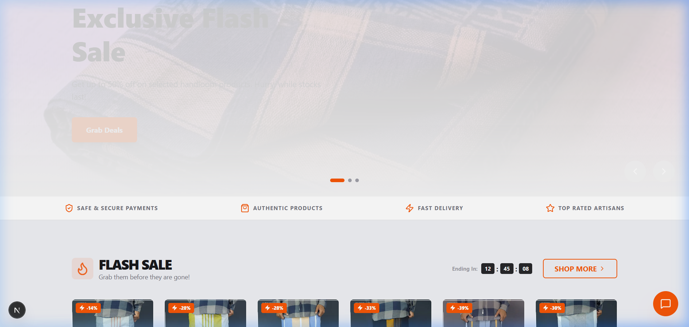
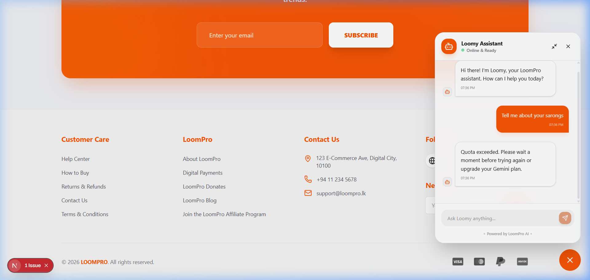
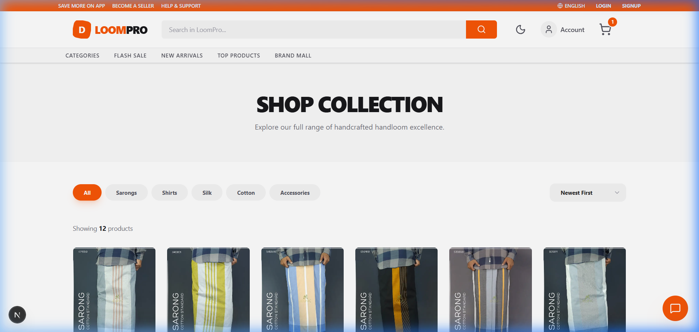
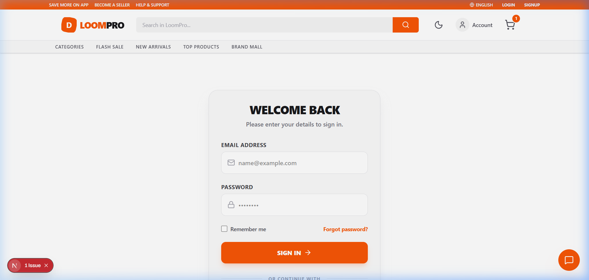

#  LoomPro | Premium Handloom E-Commerce



## 🌟 Overview
**LoomPro** is a state-of-the-art, full-stack e-commerce platform dedicated to premium handloom excellence. Built with the latest 2026 web technologies, it combines traditional craftsmanship with a high-performance digital experience.

[**🚀 Live Demo**](https://ecommerce-shajahan.vercel.app) | [**📁 Backend API**](https://ecommerce-shajahan.vercel.app/api)

---

## 🤖 AI Concierge: Loomy Assistant
We've integrated a powerful **AI Chatbot** powered by **Google Gemini 2.0**. Loomy helps customers find the perfect handloom products, answers questions about craftsmanship, and provides instant support.



---

## 📸 Application Screenshots

### 🛒 Shop & Products
Explore our diverse collection of premium handloom sarongs and traditional wear.


### 🔐 Secure Authentication
Premium login and registration experience for a personalized shopping journey.


---

## 🛠️ Tech Stack

<p align="left">
  
  
  
  
  
  
  
</p>

---

## ✨ Key Features

- **🤖 AI Concierge**: Real-time assistance powered by Gemini 2.0.
- **💎 Premium UI/UX**: Modern glassmorphic design with ultra-smooth animations.
- **🌗 Dual-Theme System**: Sleek light and dark modes optimized for premium aesthetics.
- **🛒 High-Performance Cart**: Real-time state management using Zustand.
- **⚡ Turbopack Powered**: Lightning-fast build and load times using Next.js 16.
- **📱 Mobile-First**: Fully responsive design for the ultimate shopping experience on the go.

---

## 📂 Project Structure

```bash
.
├── src/                # Next.js 16 Application (Frontend)
│   ├── app/            # App Router (Pages & API Routes)
│   ├── components/     # UI & Layout Components
│   └── store/          # Zustand State Management
├── backend/            # Express.js API & AI Logic
│   ├── src/controllers # Request Handlers
│   ├── src/models/     # Mongoose Models
│   └── src/routes/     # API Routes
├── public/             # Static Assets & Screenshots
└── vercel.json         # Unified Deployment Config
```

---

## 🚀 Getting Started

### 1️⃣ Setup & Environment
Clone the repo and add your keys to a `.env` file in the root:
```env
MONGO_URI=your_mongodb_uri
JWT_SECRET=your_secret
GEMINI_API_KEY=your_gemini_key
NEXT_PUBLIC_API_URL=http://localhost:5000/api
```

### 2️⃣ Run Locally
```bash
# Install root dependencies
npm install

# Run both Frontend & Backend concurrently
npm run dev:all
```

---

## ☁️ Deployment (Vercel)
This project is optimized for the **Modern Vercel Pipeline**:
1. Connect your GitHub repo to Vercel.
2. Add your environment variables in the Vercel Dashboard.
3. Deploy! Vercel handles the Next.js frontend and the Node.js functions automatically.

---

<p align="center">
  Crafted with ❤️ by <b>Imdaad Shajahan</b>
</p>
